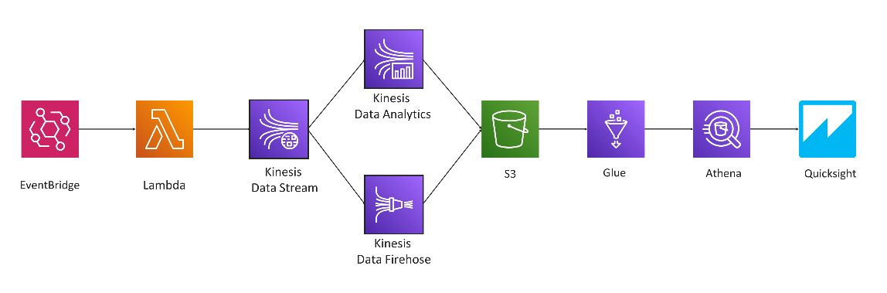
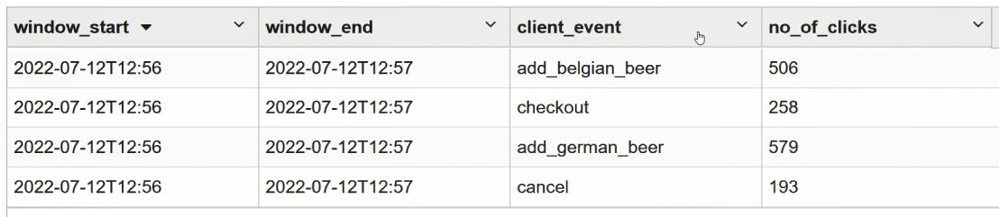
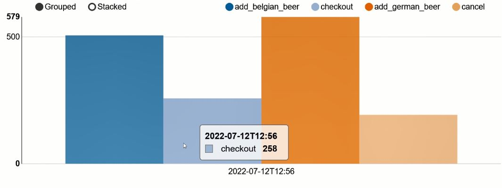

### Create Real-Time Clickstream Sessions And Run Analytics

#### Background of this repo

Capturing and processing data clickstream events in real time can be difficult. As the number of users and web and mobile assets you have increases, so does the volume of data. In this session we will demonstrate how to identify and create sessions from real-time clickstream events and then analyze them using Amazon Kinesis Data Analytics.

This repo shows a part of the prototype built for this session.

#### Architecture



##### Data input

Since is no real website the click-stream data has to be mocked by the Lambda Funcion. This function was regularly invoked by an Even-Bridge rule. The code can be found in lambda.py. Here is an example of the output when running the function.
```json
{
'user_id': *157, 
'device_id': *'computer',
'client_event’: *‘add_belgian_beer',
'client_timestamp': *'10:28:27 […]’
'countrycode’: *'DE' 
 }
```

##### Store raw data and analyse data live

The original datastream serves as a source to AWS Kinesis Firehose and AWS Kinesis Analytics (KDA). Firehose directly stores data in S3 to persist the raw data. Analytics can be used to analyze data on the fly and eventually aggregate data into 1 minute sessions. You can find a part of the code in the analytics.sql file.
KDA allows you to code in a Zeppelin Notebook (which is good for development purposes) and push your project directly to Flink (managed Version in KDA). Below you can find two visualizations of the data in the Zeppelin Notebook.




##### Next?
The next section will follow in a while. However, the resources that you find in the "Resources worth readin" section. Will contain more relavant information.


#### Resources worth reading

*[1] Blogpost about (legacy) Kinesis*
https://aws.amazon.com/blogs/big-data/create-real-time-clickstream-sessions-and-run-analytics-with-amazon-kinesis-data-analytics-aws-glue-and-amazon-athena/ 

*[2] Work with and debug Kinesis (esp. Flink)*
https://catalog.us-east-1.prod.workshops.aws/workshops/c342c6d1-2baf-4827-ba42-52ef9eb173f6/en-US/flink-on-kda/advanced-scale-and-monitor/flink-dashboard

*[3] Call Kinesis from your frontend*
https://docs.aws.amazon.com/sdk-for-javascript/v2/developer-guide/kinesis-examples-capturing-page-scrolling.html

*[4] Get started with the Kinesis Studio*
https://aws.amazon.com/blogs/aws/introducing-amazon-kinesis-data-analytics-studio-quickly-interact-with-streaming-data-using-sql-python-or-scala

*[5] Apache Zeppelin Notebook*
https://zeppelin.apache.org/
