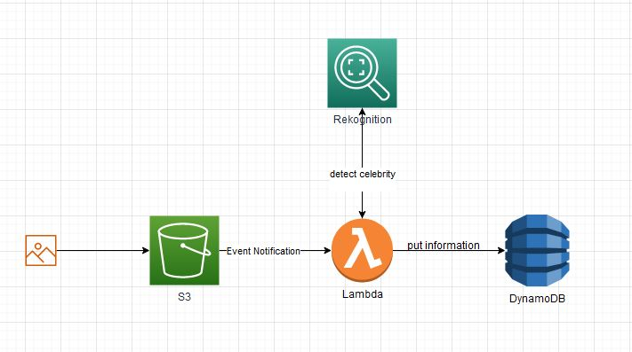

# Automatically detect a celebrity on an image and store result in DynamoDB

Deploying this SAM template will give you an S3 bucket which directly invokes a Lambda function, whenever a new object is uploaded.
This Lambda function will use the Rekognition service to detect the face of a celebrity and stores the result in a DynamoDB table.

All resources and also the code will be provisioned by running this template.

Prerequisites:
- You need to provide an IAM Role Arn while deploying the template. This role should have access to DynamoDB as as well as to Rekognition. Note: I like using wide policies first and then shrink them using the access analyzer.

Hint:
- make sure to use only valid S3 bucket names (leads to "Bad Request" error)

