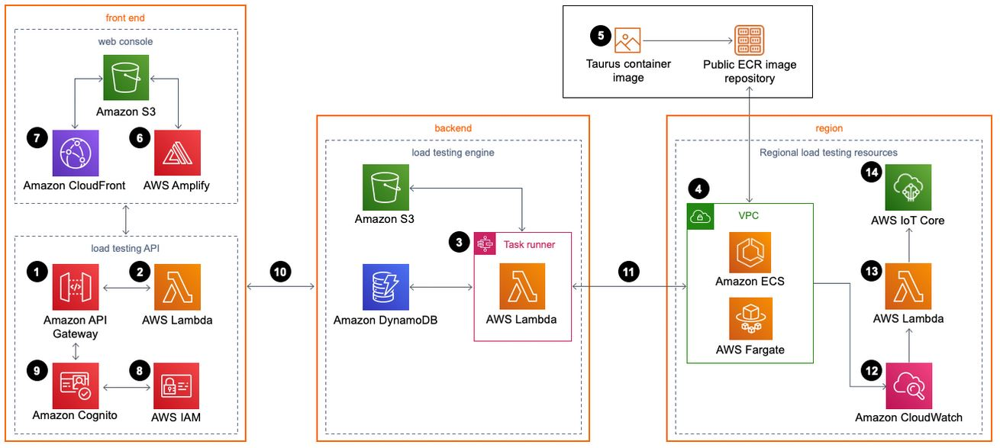
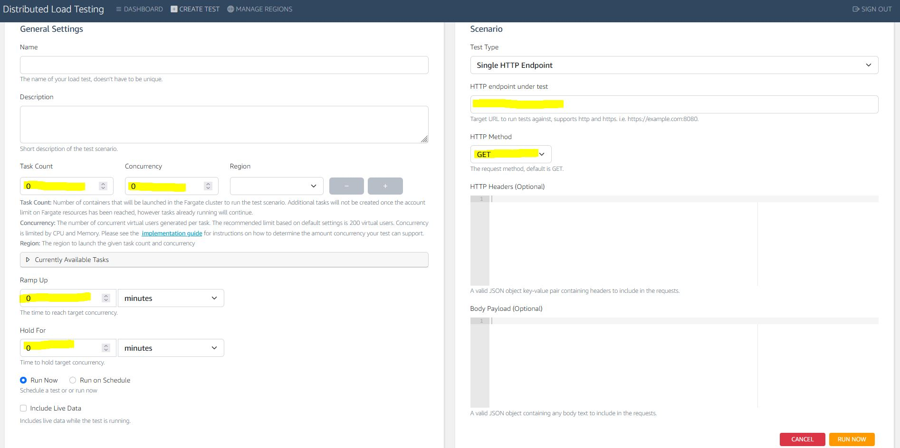
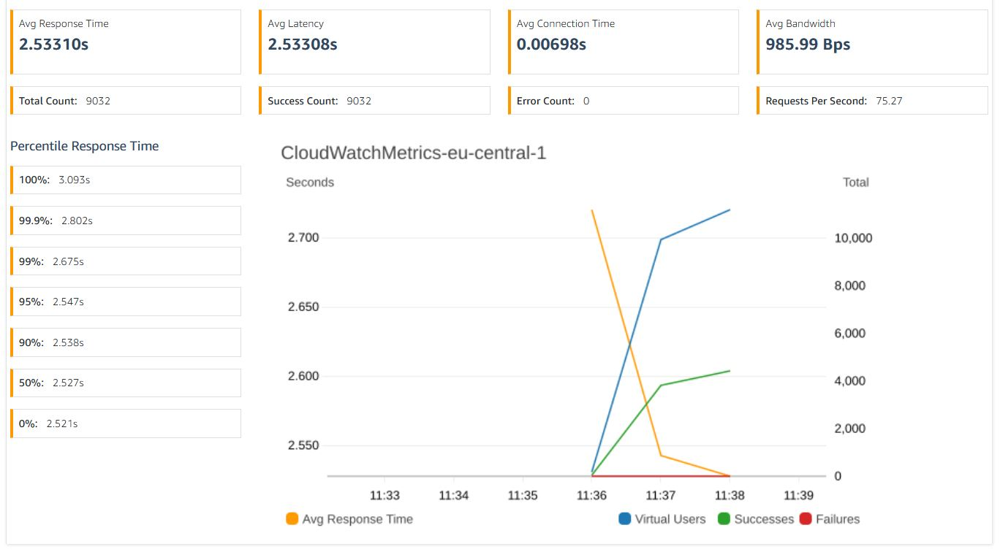

## **Distributed Load Testing**

There are many ways and tools to loadtest (serverless) applications. The AWS Solutions Library offers
a tool [1] that is deploying containers using a Taurus Docker image [2], wrapping JMeter [3] for you. Those
containers are deployed on Fargate.

Below you can find some images of the architecture and the tool:
- Image 1: What this AWS Solution will setup in your account
- Image 2: Showing the UI used to configure the test
- Image 3: Test results of a small test

Images:

*Image 1: What this AWS Solution will setup in your account*

*Image 2: Showing the UI used to configure the test*

*Image 3: Test results of a small test*

[1] https://aws.amazon.com/solutions/implementations/distributed-load-testing-on-aws/

[2] https://gettaurus.org/

[3] https://jmeter.apache.org/
