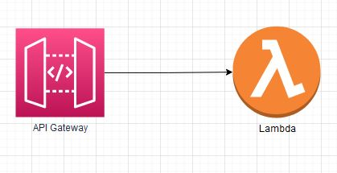

### **Deploying an application to test**

This SAM template deploys a Lambda function which takes X minutes (it's a variable set to 5 minutes by default)
to execute and an API Gateway to invoke that function from a public endpoint. Since the function takes X amount of time to
execute it is easier to play around with concurrency limits and see how this limit goes up every minute when reaching the initial regional soft limit.
Please remember to change the timeout of the Lambda function to at least the runtime X that you set within the function.

</br>
Image 1: What this template will deploy

<figcaption>Image 1: What this template will deploy</figcaption>
</br>

**Note:**
This deployment is very close to the sample application which can be found here [1]. However, I changed the code of the lambda function in the repo.

Interesting command if you want to keep working with this other other SAM projects:

``` bash
sam sync --watch --stack-name STACKNAME
```

**How to run this template?**

Either you just take the code of the Lambda function `(/hello_world/app.py)` and build the function & and later the API Gatway endpoint yourself.
Or you can use AWS SAM [2]. After installing sam you can run the following to commands to build and deploy this application

``` bash
sam deploy --guided
sam-app sam deploy --guided
```

[1] https://docs.aws.amazon.com/serverless-application-model/latest/developerguide/serverless-getting-started-hello-world.html#serverless-getting-started-hello-world-init

[2] https://docs.aws.amazon.com/serverless-application-model/latest/developerguide/what-is-sam.html

